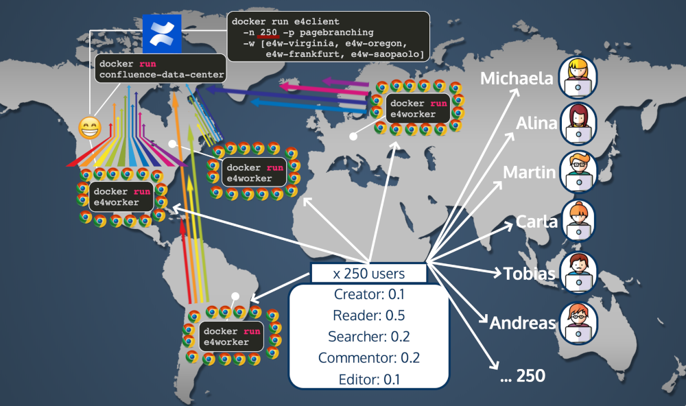

# E4 - The enjoyable performance testing framework

E4 is intended for performance and scale testing web applications with arbitrarily many browser agents running on arbitrarily many "worker nodes" around the globe. Check out the [E4 presentation](https://slides.com/fgrund/e4/live) for an introduction.

## Disclaimer

This project and its documentation are work in progress.
While E4 is applicable for any web application, it is currently being used and designed as performance testing framework for Atlassian's data center products (particularly Confluence at the moment). 
This will change in the future.

## Why E4?

Our work on E4 was motivated by us not finding the means to test our own Atlassian apps properly with the tools available. In particular, we were bugged by a lack of platform independence (only for a specific product), transparency (what is happening? why am I paying so many $$$ to AWS?) and versatility in testing (e.g. only REST or only Selenium user interaction). 

Therefore, we designed E4 with the following goals in mind:

* E4 works for _any application_ that runs in a browser (at least theoretically; we're not there yet).
* E4 does not fully automate _everything_. We want the developer to remain aware of _what's happening_. For example, we intentionally do not start scripted AWS instances. We accept that using E4 is _not a single command_. We try to make it as easy as necessary - but not easier.
* E4 provides means to test an application with a mix of _HTTP requests and Selenium_. We think that both types of interaction (simulated users using a browser _and_ manually sending HTTP requests / REST calls) are necessary for proper testing. The frameworks we have seen support only one of the two.

## How does it work?



E4 is intended for developers who want to test their web application under load.
The developer implements a _test package_ for her web application that defines how the application is tested with REST and Selenium interactions.
The test package is then executed with a number of concurrent _virtual users_ that are distributed among a configured number of _worker nodes_.
The number of virtual users that are created are defined by the number of configured concurrent users for a test run and the _weight_ specified for each virtual users in the test package.
For example, three virtual users "Creator", "Reader", "Searcher" with weights 0.2, 0.5, 0.3 respectively in the test package, and 100 concurrent users are configured, there will be 20 Creators, 50 Readers and 30 Searchers. Each worker node is a Docker container that executes a fragment of these virtual users (or all if only one worker node is configured).

E4 Workers have REST endpoints and are orchestrated by an E4 client application that is controlled by the developer.
This application is configured with a JSON file specifying the number of concurrent users to simulate, how long to simulate them, and onto which worker nodes to distribute them. 
Each virtual user are assigned a number of _actions_.
These are executed in a loop that only ends when the test duration (specified by the developer) ends. 
The result of each worker when the test duration ends is an SQLite database file containing measurements for all actions performed.

We think it is most intuitive to see an example worker log output to get a better picture how this works. [Here](doc/sample-worker-log.zip) you can find the (compressed) logs for a test run simulating a "Vanilla" test package for a Atlassian Confluence (Data Center) application.

## What do I need to do to test my application?

You will need to:

1. Implement a test package with Kotlin
1. Have your application running and accessible by HTTP
1. Start worker nodes and run the test package
1. Collect and process the data from the results

For each of the points above there is a section in this documentation below:

1. See section "How to implement a test package?" (XXX)
1. See section "How do I start a test instance?" (XXX). We provide a Docker tool suite to start a test Confluence instance based on a _large dataset_ as defined by Atlassian. The same is in progress for Jira.
1. See section "How to start a worker and run a test package?" (XXX)
1. See section "How to collect and process data?" (XXX)

## How to implement a test package?

### What is a test package?

A test package is a bunch of Kotlin source files that define how an app can be properly tested. The intention is that the test package is independent from any structural components of the framework and focuses on the tasks that are required to test the application.

### Components of a test package

Each test package has a set of components that have certain purposes. All sources for a test package live in `de.scandio.e4.testpackages` in `src/main/kotlin/` and `src/test/kotlin/`.

#### TestPackage declarator

At the top level is a class that extends `TestPackage`. It defines the following:

* **Virtual Users**: a set of simulated users that perform actions against a running application. Each virtual users are assigned one or more _actions_.
* **Weights**: in what quantities/relations/ratios should virtual users be distributed onto worker threads?
* **Setup Actions**: a set of _actions_ that must be executed before the virtual users can be simulated.

#### Virtual User

Classes in the sub-package `virtualusers` that define virtual users. A virtual user repeatedly executes one or more actions, each of which can be measured in terms of `time_taken`. 

#### Action

Classes in the sub-package `actions` that define actions invoked by virtual users. Actions define what steps should be measured as `time_taken`. This allows to run procedures that are not measured (e.g. login procedures).

#### Developing a test package

During development of a test package, it makes most sense to forget about the rather complex test architecture of E4. Just assume two things:

* You have a simple test instance of your application running (this doesn't need to have a particularly large dataset)
* You have one admin user in the application that is used for running all virtual users

Once you make sure this works as expected, you can scale up (see later sections).

Create a unit test class in your Kotlin test package that extends [`TestPackageTestRun`](src/test/kotlin/de/scandio/e4/testpackages/TestPackageTestRun.kt).
Create a test method like this:

```
@Test
fun runTest() {
    val testPackage = VanillaTestPackage()
    if (E4TestEnv.PREPARATION_RUN) {
        executeTestPackagePrepare(testPackage)
    } else {
        executeTestPackage(testPackage)
    }
}
```

See [`VanillaTestRun`](src/test/kotlin/de/scandio/e4/testpackages/vanilla/VanillaTestRun.kt) for an example that shows the example for our Confluence `VanillaTestPackage`.

A few environment variables should be set to make this know where things a are:

* `E4_APPLICATION_BASE_URL`: specifies the base URL where your application is running and accessible by HTTP. (default: `http://confluence-cluster-6153-lb:26153`. This is based on the E4 docker toolkit for Confluence data center.)
* `E4_APPLICATION_NAME`: name of application/platform on which you are testing. (Currently `confluence` and `jira` are supported. Default: `confluence`)
* `E4_APPLICATION_VERSION`: version of the application/platform (default: `6.15.3`)
* `E4_USER_NAME`: username of an admin user in the application (default: `admin`)
* `E4_USER_PASSWORD`: password of an admin user in the application (default: `admin`)
* `E4_IN_DIR`: path to directory where files needed for a test package are located (default: `./target/in`)
* `E4_OUT_DIR`: path to directory where output files from E4 are produced (default: `./target/out`)
* `E4_PREPARATION_RUM`: set this to `true` if you want to simulate a preparation run (default: `false`)

We used IntelliJ to set the environment variables and then run the unit tests.
It looks like this for the `VanillaTestPackage`:


The output then looks like this:

XXX

#### Run the vanilla Confluence example yourself

When you clone this repo and set the above JUnit configuration, you should be able to run the `VanillaTestPackage` against your running Confluence instance (this can be a simple empty server instance and doesn't need to be data center). 
If you get this to work, you're not too far away from executing a proper Confluence data center test. 
Feel free to create an issue in this repo if it doesn't work for you and we'll try to help. 

#### Explaining test packages with the `VanillaTestPackage` example

The `VanillaTestPackage` is a test package specific for Atlassian Confluence that is as basic as possible. 
There are 6 virtual users:

* Commentor (weight 0.08) - creates comments
* Reader (weight 0.36) - reads pages and blog posts
* Creator (weight 0.08) - creates pages and blogposts
* Searcher (weight 0.16) - uses the confluence search
* Editor (weight 0.16) - edits pages and blogposts
* Dashboarder (weight 0.16) - visits the dashboard

The weights add up to 1.0, which is necessary for the E4 logic when virtual user instances are created.
If this is not the case, E4 will show a validation error and will not start.
Also, all weights will need to be a multiple of 0.02 (or 0.02) which is for reasons of the internals of the virtual user creation algorithm in E4.

Assume the developer specifies that she wants to run 150 concurrent users.
This will mean that `weight * 150` instances of each virtual user will be created:

* Commentor (weight 0.08) - `0.08 * 150 = 12 virtual users`
* Reader (weight 0.36) - `0.36 * 150 = 54 virtual users`
* ... (you get the idea) ...

While a virtual user in E4 can execute arbitrarily many actions, each virtual user in this test package executes only one action.
These actions are called in a loop, which means that in this example a virtual user will always execute the same actions.

The `virtual users vs. actions` will therefore have 6 columns (virtual users) and only one row (actions).

<table style="text-align: left">
	<tr><th>Commentor</th><td>AddRandomCommentAction</td></tr>
	<tr><th>Reader</th><td>ViewRandomContent</td></tr>
	<tr><th>Creator</th><td>CreateRandomPageAction</td></tr>
	<tr><th>Searcher</th><td>SearchLoremIpsumAction</td></tr>
	<tr><th>Editor</th><td>EditRandomContent</td></tr>
	<tr><th>Dashboarder</th><td>ViewDashboardAction</td></tr>
</table>

While we think this is both simple and does the job of performing different actions against a running application (in this case Confluence), E4 is certainly open for other matrices.
For example, you could think of 3 virtual users `ConfluenceSimpleUser`, `ConfluencePowerUser`, `ConfluenceAdministrator`, that all execute an overlapping set of actions.
In that case there would be only three rows but many more columns in the matrix above.

## How do I start a test instance?

First off: __it's up to you and it's intended!__
We did not want to take all the control away from you!
The idea is: you can start whatever application you want in any environment you want!

However, E4 will help you creating a Confluence/Jira data center instance for testing.
Based on [codeclou](https://github.com/codeclou)'s **AMAZING** [Docker Confluence Data Center](https://github.com/codeclou/docker-atlassian-confluence-data-center) and [Docker Jira Data Center](https://github.com/codeclou/docker-atlassian-jira-data-center) scripts we have created a script for orchestrating a dockerized data center environment for this purpose. 

In this section we describe how we created a Confluence data center instance for testing.
We think it's fairly easy to adapt this for one's particular needs.

**Note**: the developers behind E4 are mainly Atlassian app developers, so we are no DevOps/AWS/Docker pros.
Some of the steps in this manual can most likely more automated or generally more convenient.
But it worked for us this way.

### How to start a Confluence Data Center test system

You need some server with enough resources to run all parts of the cluster (i.e. all application nodes, database, load balancer).

For a `small dataset`, 50/150/250 concurrent users, and 1/2/4 nodes, we used an `t2.2xlarge` (8 CPUs, 32 GB RAM, 20 GB storage) AWS EC2 instance. 
For a `large dataset`, and the same configurations, we used a `c5n.9xlarge` (36 CPUs, 96 GB RAM, 50 GB storage) instance.
In general, we have observed that demand of resources increases strongly with the size of the dataset.

All the instances were Ubuntu systems. 
Docker needs to be installed which we scripted with `./docker/atlassian-cluster/docker-install-ubuntu.sh`.
This script will also create a directory for provisioning and set an environment variable accordingly.
You can also just look at the script and execute the steps manually.
In general the requirements are:

1. Installed: `docker-ce`, `docker-ce-cli`, `containerd.io`
1. Docker user setup: `sudo usermod -a -G docker ubuntu`
1. Environment variable `E4_PROV_DIR` set to some directory that E4 will use for provisioning resources

On the server, we started our test environment with our script `./docker/atlassian-cluster/e4-atlassian-cluster.sh` (again, this is based on [codeclou](https://github.com/codeclou)'s amazing software).
A cluster with 1 node, a heap space of 4096MB, and a ready-made small dataset is started with this command:
```
./e4-atlassian-cluster.sh --action create --scale 1 --appname confluence --version 6.15.3 --provkey conf6153_small --nodeheap 4096
```

The parametersa are as follows:

* `action`
